Keepmarks
===================

Keepmarks facilitates exploring, viewing and organizing your bookmarks from a single screen.

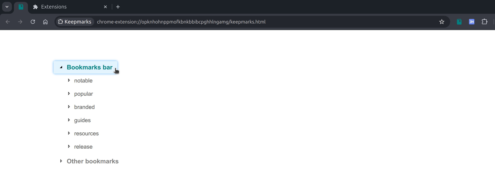

### Features

- Simple, clean design with convenient features.
- View various folders in multiple columns.
- Structure, organize the folders and bookmarks.

This extension opens in a new page on clicking the action icon and does not replace the new tab or the bookmarks organizer page. Explore the various subfolders by clicking on the folder to expand and contract each folder. This facilitates viewing multiple folders alongwith the bookmarks it contains in a concise manner.

The views can be organized into multiple columns by extracting a folder to generate a new column. Multiple columns can be generated in this manner and the folders can be moved around by selecting the right option from the menu that appears on right clicking the extracted folder. These folders can be retracted back to the original parent as well.

Dragging and dropping is allowed for subfolders that enables the restructuring or organization of folders as well as bookmarks. In addition, a bookmark can be edited or deleted as well. The main focus of the application is to enable convenient viewing of bookmarks, review existing structure and modify them conveniently.

Explore Bookmark Folders
-----------
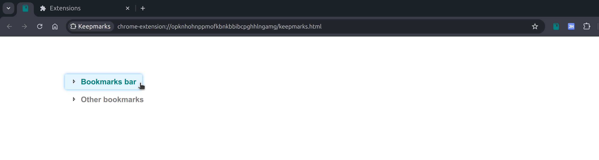
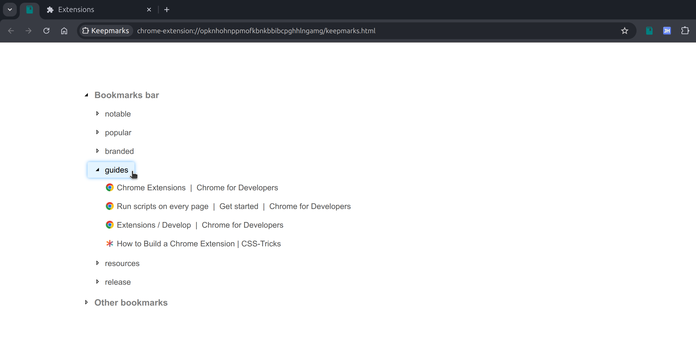
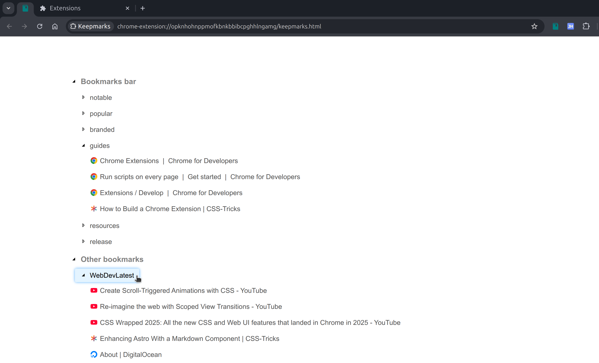

View Folders as multiple Columns
-----------

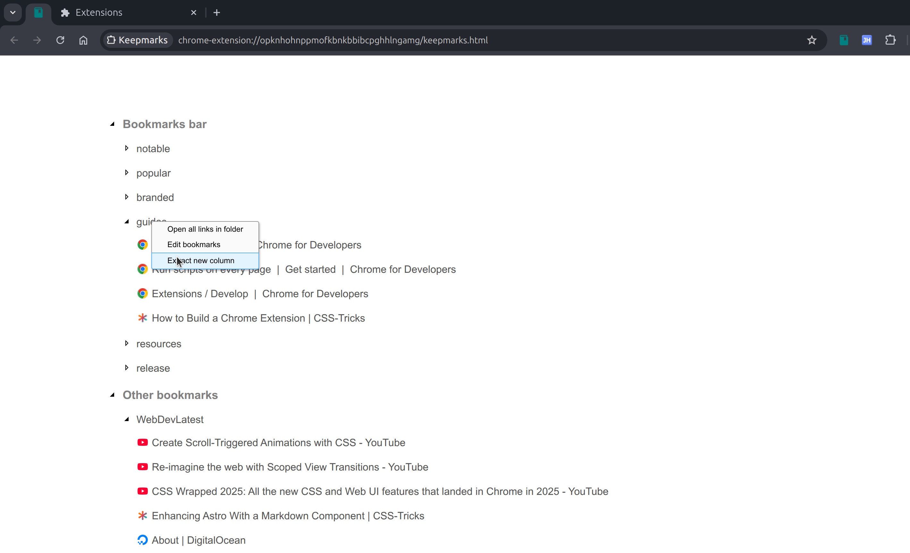
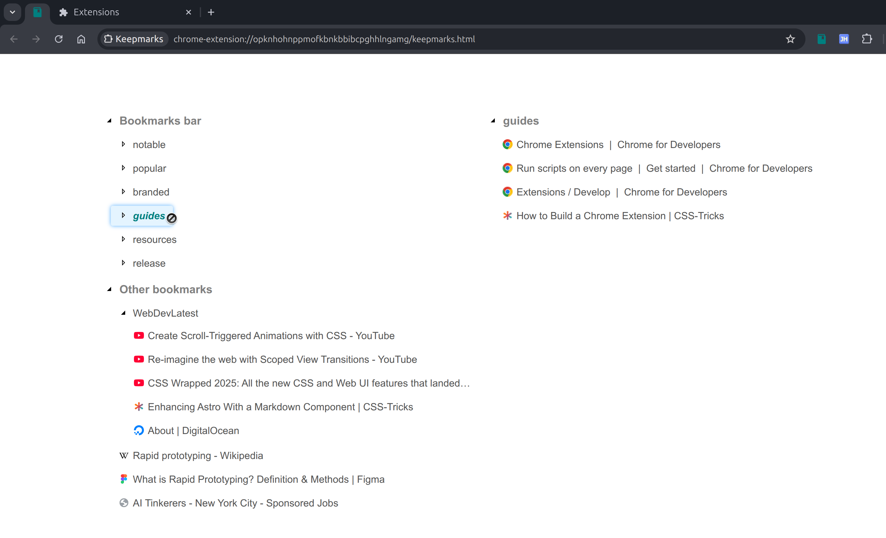
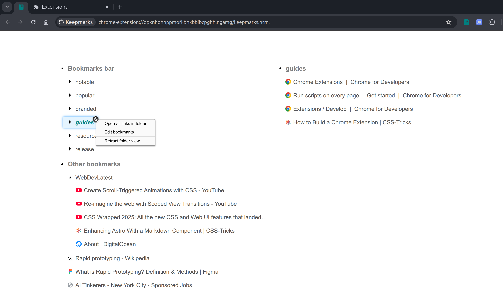
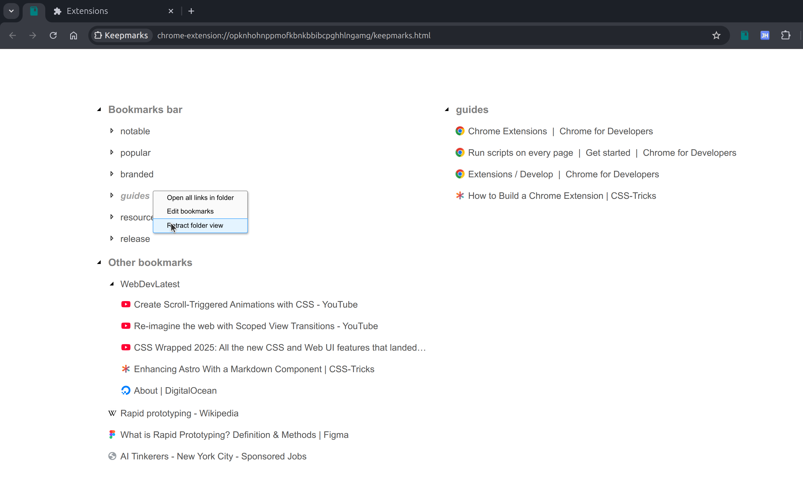
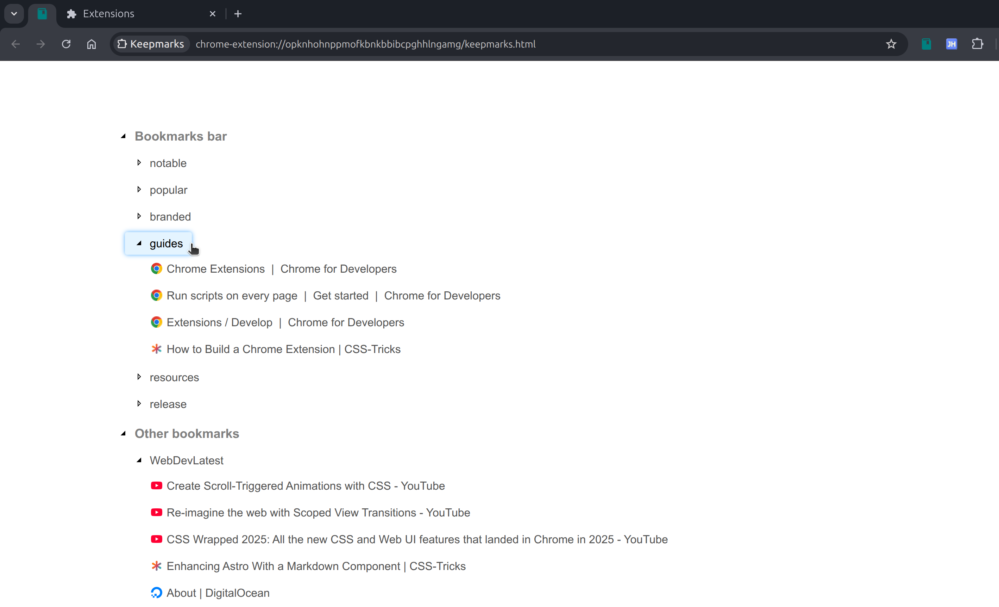
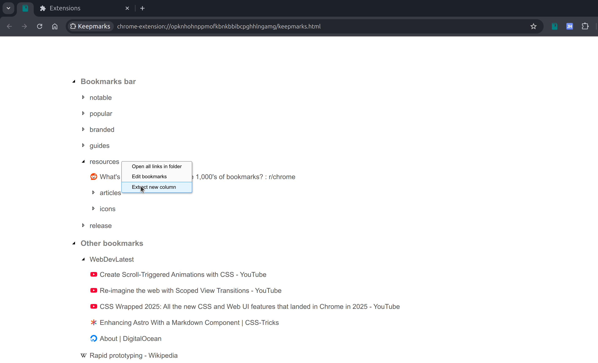
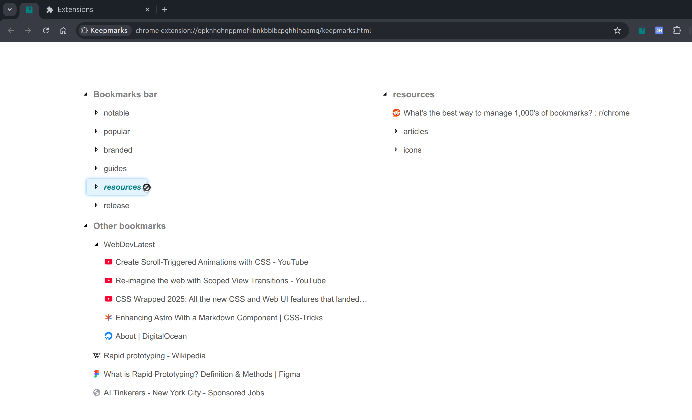

Restructure Bookmark Folders
-----------

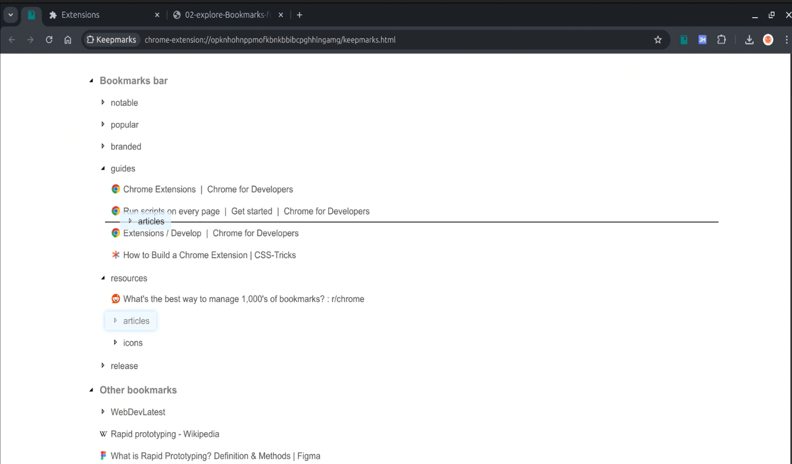
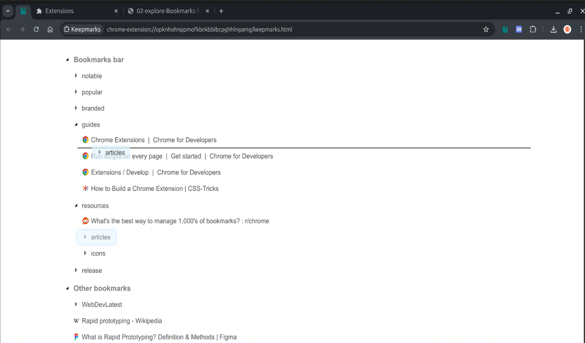

License
-------

This project is licensed under the **MIT License**, see [LICENSE_MIT.txt](LICENSE_MIT.txt) for details.

Changelog
---------

### Version 0.1.0 - May 4, 2025

- Initial version with features for modifying folder structure on drag and drop.
- Simplified the application to ensure drag and drop is used for restructuring.
- Refactored, removed features such as customization, to enable restructuring bookmarks, folders.

