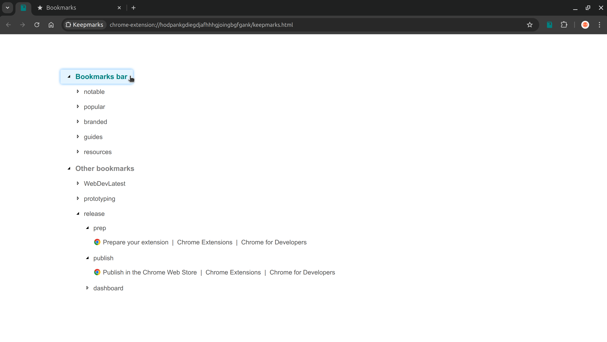
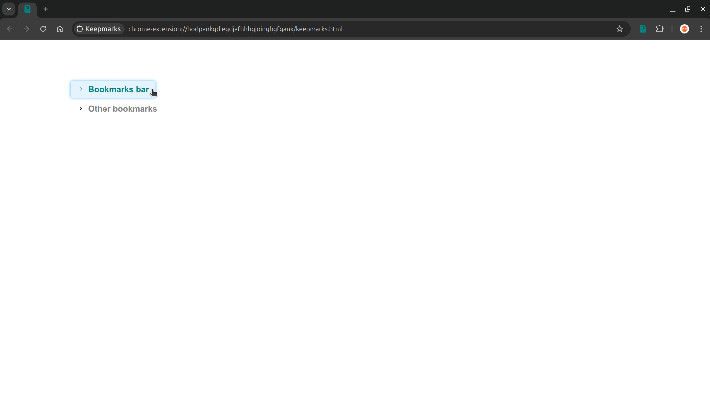
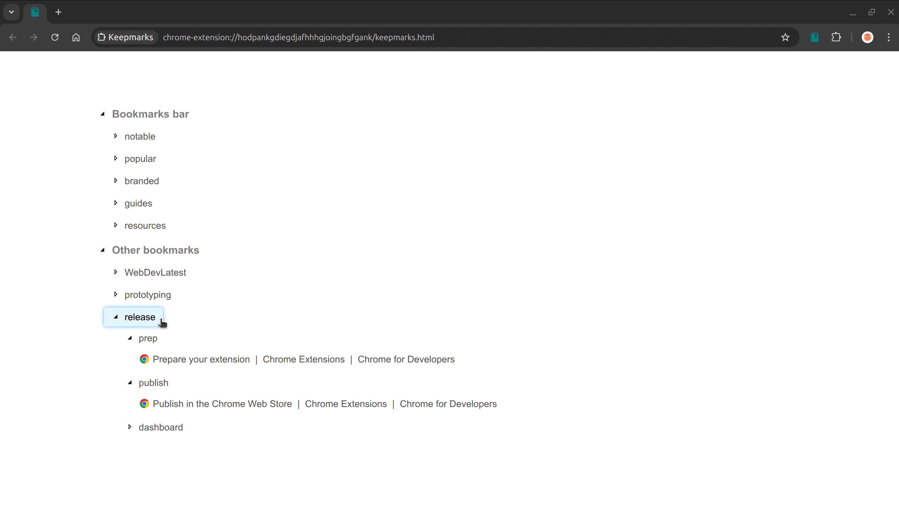
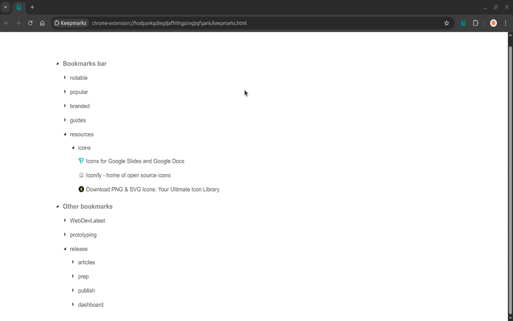

Keepmarks
===================

Keepmarks is a Chrome extension for exploring, previewing and organizing bookmarks.

Keepmarks is implemented as a single page activated on clicking the extension's action icon.

### Features

- Simple, clean and minimilastic design.
- Preview required folders in multiple columns.
- Restructure and reorganize folders and bookmarks.

Explore Bookmark Folders
-----------

Explore a subfolder by clicking on it. This toggles the open or close state of the folder to display or hide its contents respectively. This facilitates viewing multiple folders at the same time alongwith the bookmarks it contains in a concise manner.

Note that the above is a single column layout which can be customized as described next.

Preview folders as multiple Columns
-----------

The page can be organized into multiple columns by extracting a folder to generate a new column. Multiple columns can be generated and the folders can be moved around by selecting the right option from the menu that appears on right clicking the extracted folder. These folders can be retracted to close the generated view.

The actions involving creating columns, moving folders do not modify underlying Bookmarks.

Restructure Bookmark Folders
-----------

Dragging and dropping is allowed for subfolders which enables the restructuring or organization of folders as well as bookmarks. A bookmark can be edited or deleted within the page while editing a folders opens the page with Google's Bookmark manager. 

**Note** that dragging and dropping modifies the underlying Bookmarks in Google Chrome.

License
-------

This project is licensed under the **MIT License**, see [LICENSE_MIT.txt](LICENSE_MIT.txt) for details.

Changelog
---------

### Version 0.1.0 - May 4, 2025

- Initial version with features for modifying folder structures, bookmarks on drag and drop.
- Retained the context menu for previewing the folders while modifying folders on drag and drop.
- Refactored, removed features for customization to focus on functionality instead of styling.
